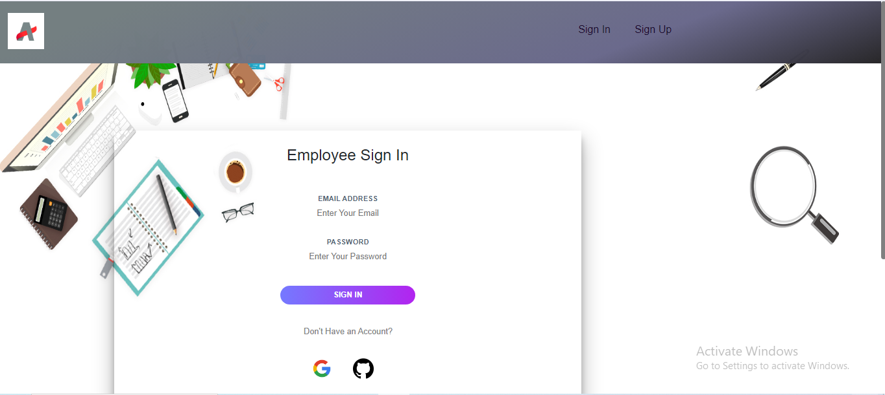
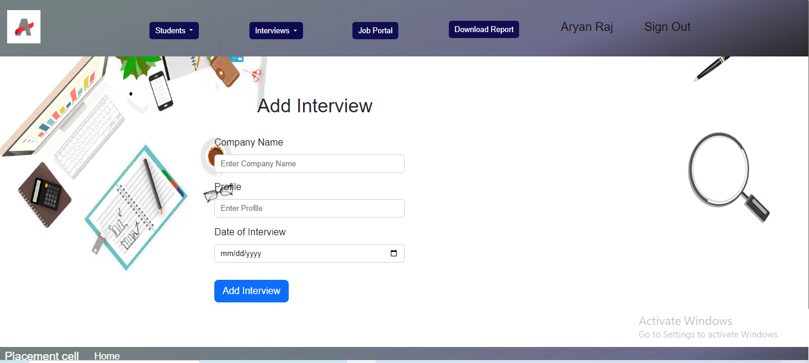

# Placement Cell App

## Introduction
The "Placement Cell App" facilitates the management of the placement process :
Student Management: Allows administrators to add, edit, and manage student profiles, including academic information and skills

Interview Scheduling: Provides functionality to schedule interviews for students with potential employers or recruiters.

Job Application Portal: Offers a platform to browse job openings and submit applications.

Placement Process Management: Helps administrators track the progress of the placement process, including the number of students placed, pending interviews, and job offers

Creating a **Placement Cell App** to maintain a database of all the student interviews. It is built using MongoDB, ExpressJS, EJS, Express-Partials-Layouts, GulpJs, Vanilla JS & implements RestFul CRUD APIs along with CRUD Operations.
This web application helps students to store following details:

 

-  Batch
-	Student Details (including college, status: [placed, not_placed])
-	Course Scores (including DSA Final Score, WebD Final Score, React Final Score)
-	Interviews (including company name and Date)
-	Results (this is a mapping between company, and student, contains result: [PASS, FAIL, On Hold, Didn’t Attempt])

 

## 🔗 Important Links

> ## Checkout the Website [Web Application](https://placement-1-1am9.onrender.com)
>
> ## Checkout the Application Demo Video.

 

## Features

- **Sign In**

 Employee can Register himself using Google, Github and by entering their required details to Register himself.

- **Sign Up**

 Employee can Login in himself using Google, Github and by manually entering username and password.

- **Update Profile**

 Employee can Update his profile by changing profile picture, name, email.

- **Add Student**

 Employee can create student using Add Student form 

- **Show Specific Student Details**

Employee can view the details of specific student

- **Show All Students List**

Employee can view the list of students

- **Update Specific Student Details**

Employee can update the details specific student

- **Delete Specific Student from the List**

Employee can delete the spefic student from the list of all students

- **Add Interview**

Employee can create a Interview Slot by specifying the Company Name and Date of Interview

- **Schedule Interview**

Employee can add students to the interview slot created for a specific company

- **List of all students in an Interview Slot**

Employee can view the list of all students who have applied for a specific interview slot

- **Update the Result of Student**

Employee can update the specific student result from the list of all students in an interview slot

- **Delete Student from Interview Slot**

Employee can delete student from an Interview Slot

- **Delete Interview Slot**

Employee can delete the created Interview Slot

- **List All Details**

Employee can view the list of all students along with their allocated interivew slots

- **Download Report in CSV**

Employee can download report in the CSV format which consists of list of all students details along with their allocated interview details and result of interview

- **Job Portal(External Jobs List)**

Job Portal consists of details of real time available job openings fetched from the external jobs API. Student can also apply for job opening which will redirected to the jobs portal remotive.com webiste

## Getting Started With Project
- Fork the Project in your Repository.
- Clone the Forked Repository in your Local System.
- Install & Configure - NodeJS, MongoDB, Robo3T, POSTMAN.
- Create '.env' file & Set the Environment Variables in it, as per the 'ENV_FORMAT.json' file.
- Run 'npm install' in GitBash Terminal
- If you want to run the project in development mode locally then go to '.env' file & set,
  ENVIRONMENT=development
  DEPLOYMENT=local
- If you want to run the project in production mode then go to '.env' file & set,
  ENVIRONMENT=production
  DEPLOYMENT=local/other/Heroku/AWS
- For Development Mode:
  Run 'npm run dev_start' in GitBash Terminal
- For Production Mode:
  Run 'npm run prod_start' in GitBash Terminal

## Tools Used

 

## Library Used
- connect-flash
- connect-mongo
- cookie-parser
- cross-fetch
- crypto
- dotenv
- ejs
- express
- express-ejs-layouts
- express-session
- json2csv
- mongoose
- multer
- node-sass-middleware
- nodemon
- noty
- passport
- passport-google-oauth
- passport-github
- passport-local

- Framework: ExpressJS, Bootstrap
- Database: MongoDB
- Version Control System: Git
- VCS Hosting: GitHub
- Programming / Scripting: Vanilla JavaScript
- Front-End: SCSS, EJS
- Runtime Environment: NodeJS
- Integrated Development Environment: VSCode

## Screens

## Sign Up 

### Sign In

### Home Page

### Add Student

### Display Specific Student Details

### Display List of all Students

### Add Interview Slot

### Schedule Interview of Student

### List of all Interviews

### List of Students in an Interview Slot

### List of all Students Details Along with Interview Details

### Profile Page

